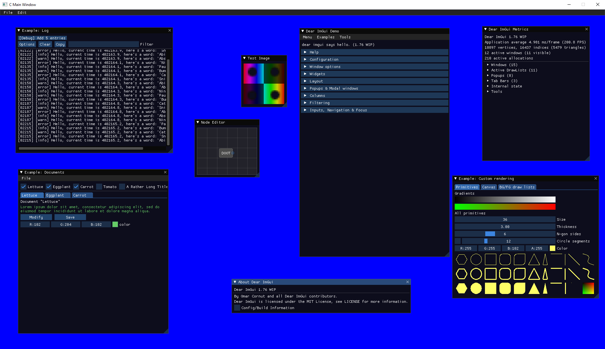

# DearImGuiSDL
 A collection of dear imgui goodies wrapped up in a nice and easy to initialize bow for simple SDL projects.
 
 
 
## Use case
I threw this together to serve as an easy to use jumping off point for those trying to learn basic computer graphics/game creation but are not yet comfortable diving into more complex graphics APIs. Supports C and C++!

## Installation
1. Include the "library" subdirectory into your CMake environment
2. Add "link_libraries(DearImGuiSDL)"
3. Add the "library" folder to your include directories.

For using SDL in CMake: https://trenki2.github.io/blog/2017/06/02/using-sdl2-with-cmake/  
Check out the test programs for how to get up and running.

## Why the uninspired naming?
Uhhh... It was the name of the folder on my computer.

## Is this tested and ready to use in production?
No, please don't!

## Includes:
* https://github.com/ocornut/imgui
* https://github.com/cimgui/cimgui
* https://github.com/Nelarius/imnodes
* https://github.com/emilk/imgui_software_renderer
